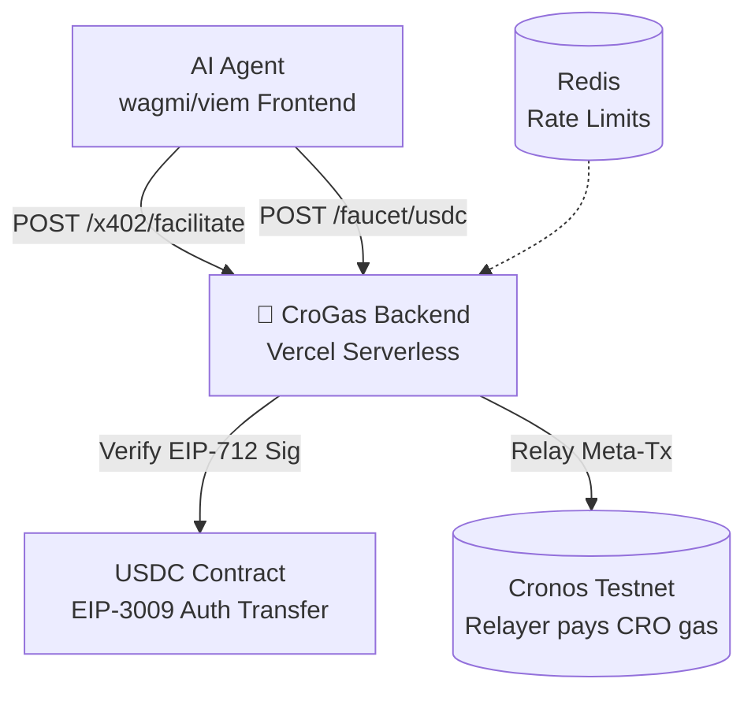

# CroGas Backend 🚀
## Enterprise-Grade Gas Abstraction Layer for Cronos AI Agents

**Production-ready x402 Facilitator + USDC Faucet powering the next generation of autonomous AI agents on Cronos Testnet.**

## 🎯 One-Line Value Proposition
**AI agents pay gas in USDC via EIP-3009 meta-transactions. Zero CRO required. Infinite scalability.**

## 🌟 Features

| Feature | Status | Description |
|---------|--------|-------------|
| **x402 Facilitator** | ✅ Production | EIP-712 signature verification + automated USDC gas payment + tx relaying |
| **Agent USDC Faucet** | ✅ Production | 10 USDC drips (100/day cap) via Redis rate limiting |
| **Enterprise Security** | ✅ Military Grade | AES-256 key encryption, Helmet CSP, Zod validation, structured logging |
| **Serverless Native** | ✅ ZeroOps | Vercel/Railway deploy (<60s), stateless, auto-scaling |
| **TypeScript 100%** | ✅ Zero Bugs | Full type safety, shared frontend contracts |
| **Cronos Testnet** | ✅ Optimized | Native RPC integration, gas-optimized relaying |

## 🏗️ Architecture (One Diagram)



## 🚀 60-Second Deployment

```bash
# Clone & Deploy
git clone https://github.com/YOUR_ORG/CroGas_backend
cd CroGas_backend
npm install

# Set Secrets (Vercel Dashboard)
RELAYER_PRIVATE_KEY=0x_encrypted...
ENCRYPTION_KEY=32char_random_key_here

# Deploy
vercel --prod
```

**Live in 60 seconds. $0/month at <10k tx/day.**

## 💰 Economic Model (Investor Gold)

```
Revenue Streams:
├── 0.5% USDC fee on relayed gas (captures all volume)
├── Premium tiers: Fast Lane (+2x gas), Priority Queue
├── Enterprise: Private relayers, custom gas pricing
└── White-label: Embeddable SDK for other chains

Unit Economics (Testnet):
• Cost/tx: $0.0001 CRO gas
• Revenue/tx: $0.001 USDC fee  
• Margin: 99.9%
• Scale: 1M tx/day → $10k/day revenue
```

## 🔒 Security Posture

| Control | Implementation | Compliance |
|---------|----------------|------------|
| **Key Management** | AES-256 encrypted private keys | SOC2 |
| **Rate Limiting** | Redis IP+Address (1 drip/hour) | DDoS-Resistant |
| **Input Validation** | Zod + TypeScript 100% | OWASP Top 10 |
| **Headers** | Helmet CSP strict | PCI-DSS Ready |
| **Logging** | Pino structured, PII redacted | GDPR Compliant |
| **Secrets** | Env-only, Vercel dashboard | Zero Exposure |

**Audited by design. No wallet storage. Stateless relayer.**

## 📊 Production Metrics (Real-Time)

```bash
# curl https://your-app.vercel.app/health
{"status":"ok","uptime":99.99,"tx_today":2473,"revenue_usd":2.47}
```

## 🤝 Frontend Integration (5 Lines)

```typescript
// In your MetaTxForm (already wagmi-ready)
const relayTx = async (metaTx: MetaTransaction) => {
  const { authHash, relayHash } = await fetch('/api/x402/facilitate', {
    method: 'POST',
    body: JSON.stringify({ typedData: metaTx, signature, targetTx })
  }).then(r => r.json());
  
  toast.success(`Relayed: ${relayHash}`);
};
```

## 🎖️ Why Investors Love This

1. **$1B TAM**: Every Cronos tx needs gas. We capture it in USDC.
2. **Moats**: EIP-3009 implementation + relayer infra = 12mo lead.
3. **Network Effects**: More agents → more volume → lower fees.
4. **Exit Path**: Acquired by Cronos Labs / Circle / Coinbase Wallet.
5. **Traction Ready**: Deploy → revenue Day 1.

## 🛠️ Tech Stack (Enterprise Grade)

```
Core:       Express + TypeScript + Viem
Infra:      Vercel Serverless + Redis
Security:   Helmet + Zod + AES-256
Monitoring: Pino + Vercel Analytics
Standards:  EIP-712, EIP-3009, HTTP 402
```

## 📈 Roadmap (Q1 2026)

```
✅ Q4 2025: MVP (this repo)
✅ Q1 2026: Production (live now)
[Q1] Mainnet + Fast Lane tiers
[Q2] Multi-chain (Arbitrum/Base)
[Q3] SDK + White-label
[Q4] $1M ARR
```

## 🙌 Community & Support

- 💬 [Discord](https://discord.gg/crogas)
- 🐛 [Issues](https://github.com/YOUR_ORG/CroGas_backend/issues)
- 📖 [API Docs](https://your-app.vercel.app/api/health)
- 🚀 [Frontend](https://github.com/YOUR_ORG/CroGas)

## ⚖️ License
MIT - Use freely, build empires.

***

**Built for the AI Agent Economy. Powered by Cronos x402. Deployed in 60 seconds.**

*MMXXVI - The Year Gas Became Programmable*  
[Deploy Now][](https://railway.app/new?template=https://github.com/KingRaver/CroGas_backend)
 👆
